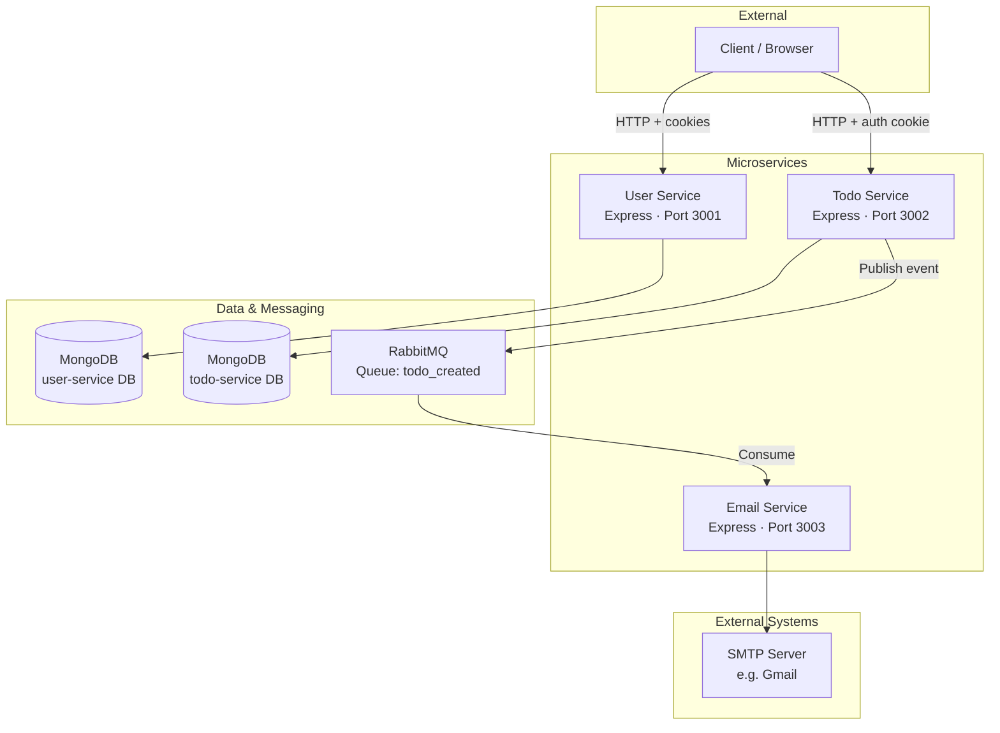
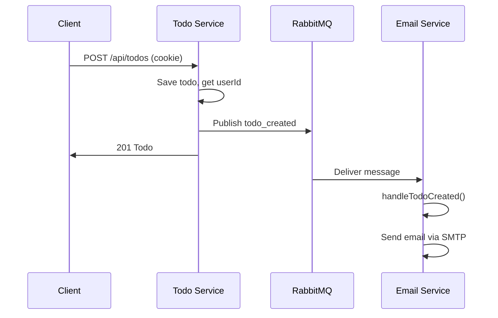
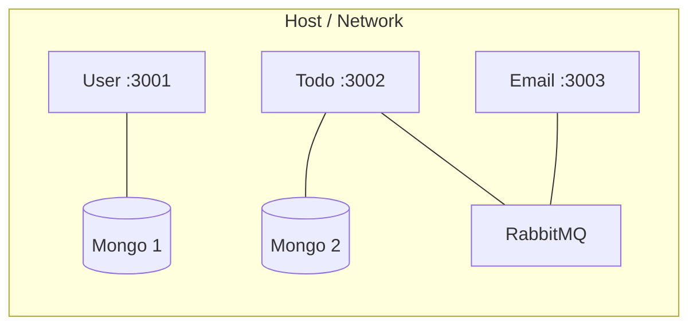

# Architecture

This document describes the high-level architecture of the microservices Todo application: components, communication patterns, and technology choices.

---

## 1. System Overview

The application is split into three main services that communicate over HTTP (client → services) and over a message queue (Todo → Email). Each service can use its own database (MongoDB) and runs independently.

---

## 2. Component Diagram

---

## 3. Service Responsibilities

| Service | Port | Responsibility | Database / Deps |
|---------|------|----------------|------------------|
| **User Service** | 3001 | Registration, login, JWT in cookie | MongoDB (user-service) |
| **Todo Service** | 3002 | Create (and manage) todos; auth required; publish events | MongoDB (todo-service), RabbitMQ |
| **Email Service** | 3003 | Consume `todo_created`; send notification emails | RabbitMQ consumer, Nodemailer → SMTP |

---

## 4. Communication Patterns

### 4.1 Synchronous (HTTP)

- **Client → User Service**: Register, login. Response includes JWT (and sets `authToken` cookie).
- **Client → Todo Service**: Create todo (and future CRUD). Client sends cookie; Todo Service validates JWT and extracts `userId`.

### 4.2 Asynchronous (Message Queue)

- **Todo Service → RabbitMQ**: After saving a todo, publishes a `todo_created` event to the `todo_created` queue.
- **RabbitMQ → Email Service**: Email Service consumes from `todo_created` and sends an email (e.g. “New todo created”) to the user.

---

## 5. Technology Stack

| Layer | Technology |
|-------|------------|
| Runtime | Node.js |
| Language | TypeScript |
| Web framework | Express |
| Databases | MongoDB (Mongoose) — one DB per service |
| Message broker | RabbitMQ (amqplib / shared client) |
| Auth | JWT (jsonwebtoken), HTTP-only cookie (`authToken`) |
| Passwords | bcrypt (hash/compare) |
| Email | Nodemailer (SMTP) |

---

## 6. Shared Library

- **Location**: `services/shared/rabbitmq/`
- **Purpose**: Reusable RabbitMQ client (connect, publish, consume, close).
- **Usage**: Todo Service and Email Service use a RabbitMQ client (e.g. `@tanuj_malode/rabbitmq` or the same logic from this shared code) to publish and consume on the `todo_created` queue.

---

## 7. Security Overview

- **User Service**: Passwords hashed with bcrypt; JWT signed with `JWT_SECRET`; token stored in HTTP-only, secure (HTTPS), sameSite cookie.
- **Todo Service**: All todo routes protected by middleware that reads `authToken` from cookies and extracts `userId` from the JWT (no server-side session store).
- **Email Service**: No direct client access; receives only internal events from RabbitMQ. SMTP credentials via environment variables.

---

## 8. Deployment View (Logical)

In production, each service, MongoDB instance(s), and RabbitMQ would typically run in separate containers or VMs, with env vars pointing to the correct URIs.

---

Next: [SERVICES.md](./SERVICES.md) for per-service structure and file layout.
