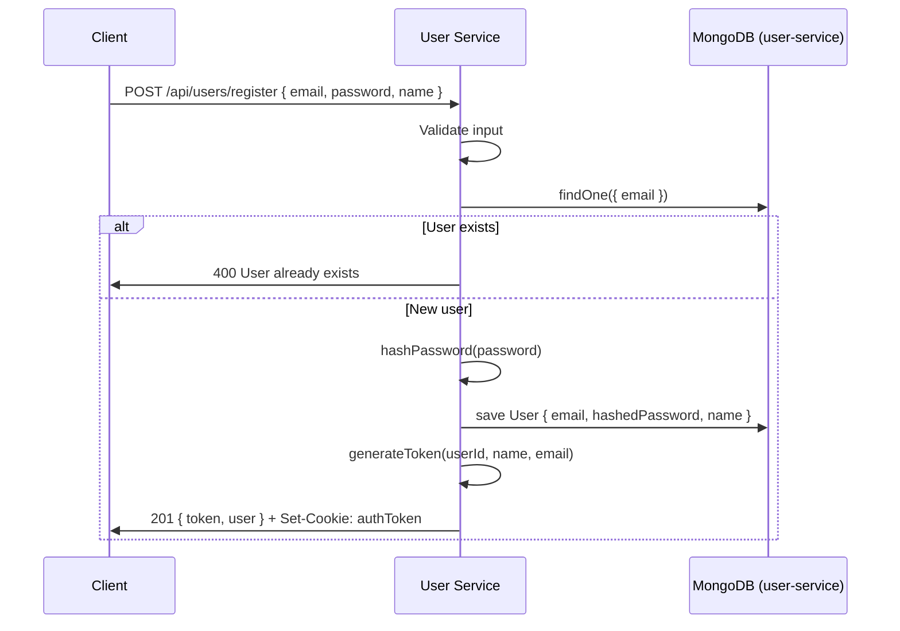
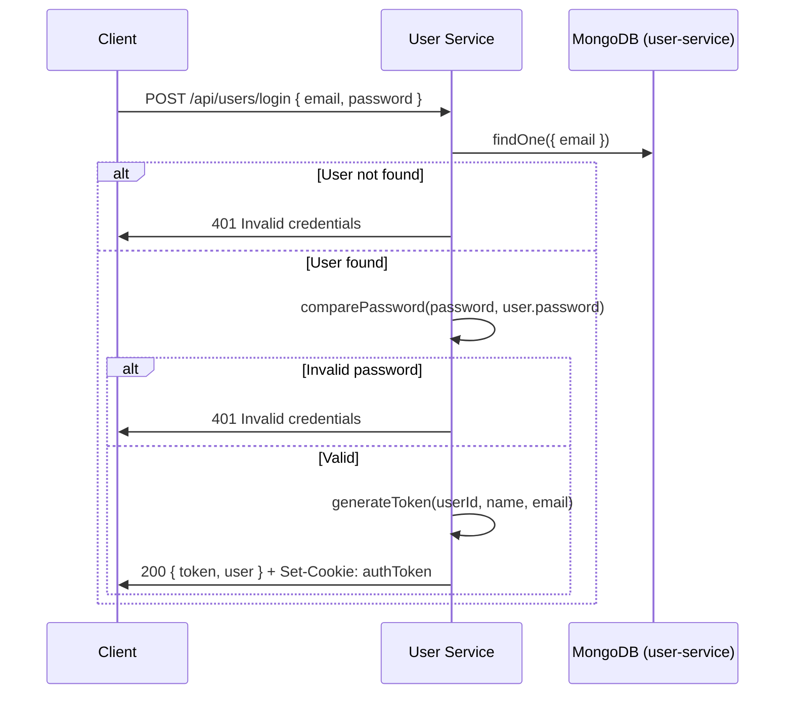
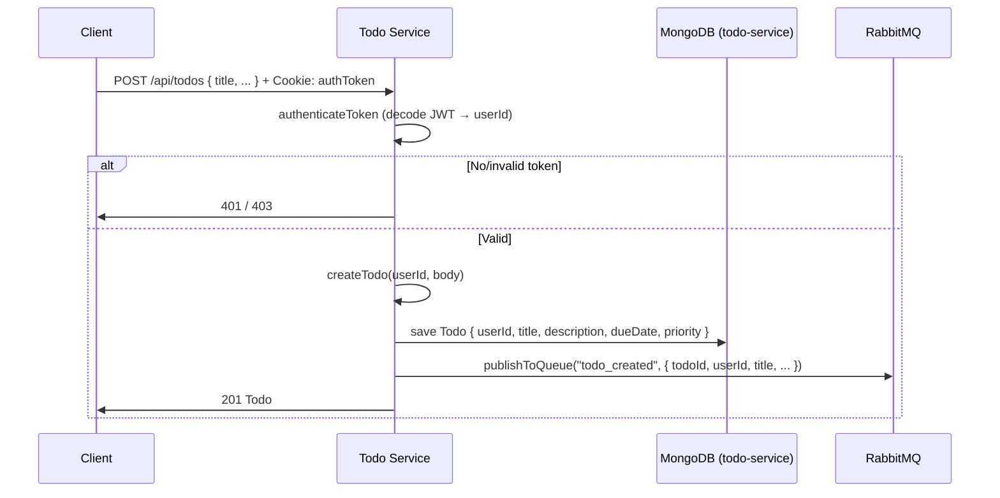
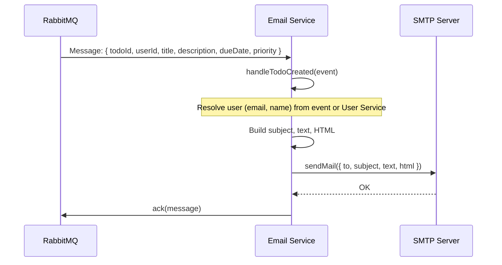
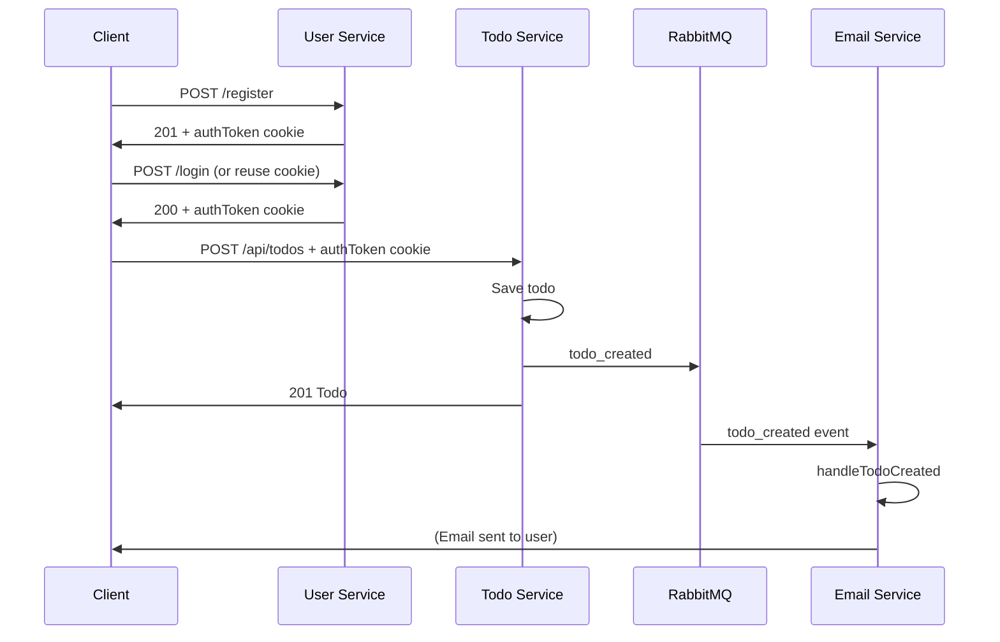
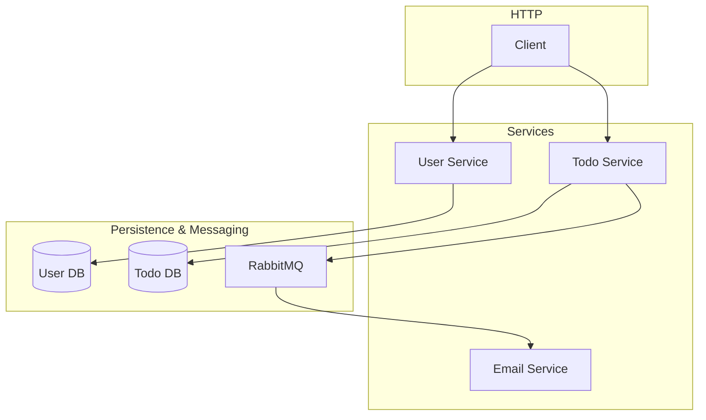

# Data Flow

This document describes the main end-to-end flows with sequence diagrams (Mermaid). Use it to see how a request or event moves through the system.

---

## 1. User Registration

Client sends email, password, and name. User Service creates the user, hashes the password, and returns a JWT (in body and in cookie).

---

## 2. User Login

Client sends email and password. User Service validates and returns a JWT (in body and in cookie).

---

## 3. Create Todo (with Auth)

Client sends todo payload with the auth cookie. Todo Service validates the token, saves the todo, and publishes an event. The response is returned immediately; email is sent asynchronously.

---

## 4. Todo Created → Email (Async)

RabbitMQ delivers the `todo_created` message to the Email Service, which builds and sends the notification email.

**Note**: In the current code, user info (email, name) for the email is expected from the event (e.g. decoded from a token). The `todo_created` payload only has `userId`. For production, either include user email/name in the event (from Todo Service) or have Email Service call User Service’s API with `userId` to fetch user details.

---

## 5. End-to-End: Register → Login → Create Todo → Email

Single diagram tying the main flow together (client perspective and backend events).

---

## 6. Component Dependency Overview

For setup and environment variables, see [SETUP.md](./SETUP.md).
