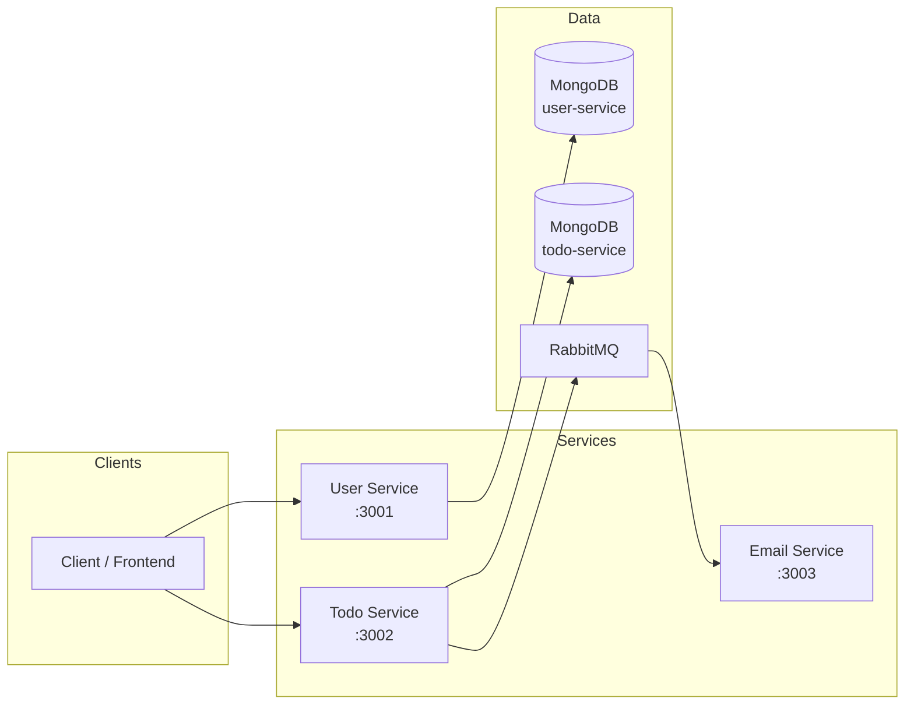

# Microservices Todo Application — Documentation

This document is the entry point for understanding the **microservices-based Todo application**. The system is built with Node.js, TypeScript, Express, MongoDB, and RabbitMQ.

---

## What This Application Does

- **User Service**: Register and login users; issues JWT in HTTP-only cookies.
- **Todo Service**: Create todos (and later extend to CRUD); requires auth; publishes events to RabbitMQ.
- **Email Service**: Listens for "todo created" events and sends notification emails (e.g. SMTP).

---

## Documentation Index

| Document | Description |
|----------|-------------|
| [**ARCHITECTURE.md**](./ARCHITECTURE.md) | High-level architecture, component diagram, and technology stack |
| [**SERVICES.md**](./SERVICES.md) | Per-service breakdown: structure, responsibilities, and key files |
| [**API.md**](./API.md) | HTTP API reference for User and Todo services |
| [**DATA_FLOW.md**](./DATA_FLOW.md) | End-to-end flows with sequence diagrams (auth, create todo, email) |
| [**SETUP.md**](./SETUP.md) | Prerequisites, environment variables, and how to run the app |

---

## Quick Diagram (High-Level)



---

## Repository Structure (Summary)

```
microservices-yt/
├── package.json                 # Root: install:all script
├── docs/                        # This documentation
│   ├── README.md
│   ├── ARCHITECTURE.md
│   ├── SERVICES.md
│   ├── API.md
│   ├── DATA_FLOW.md
│   └── SETUP.md
└── services/
    ├── user-service/            # Auth + user management
    ├── todo-service/           # Todos + event publishing
    ├── email-service/          # Event consumer + email
    └── shared/
        └── rabbitmq/           # Shared RabbitMQ client (optional local use)
```

Start with [ARCHITECTURE.md](./ARCHITECTURE.md) for the big picture, then [DATA_FLOW.md](./DATA_FLOW.md) for how requests and events move through the system.
