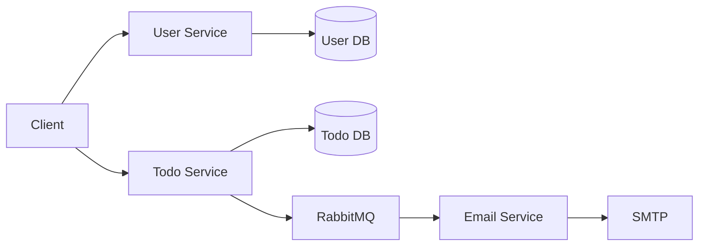

# Services Breakdown

This document describes each microservice: folder structure, main files, and how they fit into the system.

---

## 1. User Service

**Port**: 3001  
**Role**: User registration, login, and JWT issuance via HTTP-only cookie.

### Directory Structure

```
services/user-service/
├── src/
│   ├── index.ts           # Express app, DB connect, routes
│   ├── config/
│   │   └── database.ts    # MongoDB connection
│   ├── models/
│   │   └── user.model.ts  # Mongoose User schema
│   ├── routes/
│   │   └── user.routes.ts # POST /register, POST /login
│   ├── services/
│   │   └── user.service.ts# createUser, loginUser, getUserById
│   ├── types/
│   │   └── user.types.ts  # DTOs and response types
│   └── utils/
│       └── utils.ts       # hashPassword, comparePassword, generateToken, verifyToken
├── package.json
└── tsconfig.json
```

### Key Behaviors

- **Database**: MongoDB (default DB name `user-service` via `MONGODB_URI`).
- **Auth**: On register/login, a JWT is generated and set in cookie `authToken` (httpOnly, secure, sameSite, maxAge 1h).
- **Routes**: Mounted under `/api/users` (see [API.md](./API.md)).

### Main Files

| File | Purpose |
|------|--------|
| `index.ts` | Creates Express app, applies CORS/cookie-parser/JSON, mounts user routes, health check, starts server after DB connect. |
| `user.model.ts` | User schema: `email` (unique), `password`, `name`, timestamps. |
| `user.service.ts` | `createUser` (hash password, save, set cookie, return token + user), `loginUser` (validate, set cookie, return token + user), `getUserById`. |
| `utils/utils.ts` | bcrypt hash/compare, JWT sign/verify using `JWT_SECRET`. |

---

## 2. Todo Service

**Port**: 3002  
**Role**: Create (and manage) todos; authenticate via cookie; publish `todo_created` events to RabbitMQ.

### Directory Structure

```
services/todo-service/
├── src/
│   ├── index.ts              # Express app, DB + RabbitMQ connect, routes, graceful shutdown
│   ├── config/
│   │   ├── database.ts       # MongoDB connection
│   │   └── rabbitmq.ts       # RabbitMQ client, publishToQueue, connect/close
│   ├── middleware/
│   │   └── auth.middleware.ts# authenticateToken (cookie → userId)
│   ├── models/
│   │   └── todo.model.ts     # Mongoose Todo schema
│   ├── routes/
│   │   └── todo.routes.ts    # POST / (create todo)
│   ├── services/
│   │   └── todo.service.ts   # createTodo, publish event
│   ├── types/
│   │   └── todo.types.ts     # CreateTodoDTO, TodoCreatedEvent, etc.
│   └── utils/
│       └── utils.ts          # extractUserIdFromToken (JWT decode)
├── package.json
└── tsconfig.json
```

### Key Behaviors

- **Database**: MongoDB (default DB name `todo-service`).
- **Auth**: All `/api/todos` routes use `authenticateToken`; it reads `authToken` from cookies and sets `req.userId` from JWT payload (no verification, decode only in current implementation).
- **Events**: After saving a todo, publishes to RabbitMQ queue `todo_created` with `todoId`, `userId`, `title`, `description`, `dueDate`, `priority`.

### Main Files

| File | Purpose |
|------|--------|
| `index.ts` | Express app, connect DB + RabbitMQ, mount todo routes, health check, SIGINT closes RabbitMQ. |
| `todo.model.ts` | Todo schema: `title`, `description`, `completed`, `userId`, `dueDate`, `priority` (low/medium/high). |
| `todo.service.ts` | `createTodo(userId, todoData)`: create Todo, save, call `publishToQueue("todo_created", event)`. |
| `auth.middleware.ts` | Reads `req.cookies.authToken`, decodes JWT, sets `req.userId`; 401 if no token, 403 if invalid. |
| `config/rabbitmq.ts` | Uses shared RabbitMQ client; asserts queue `todo_created`; exports `publishToQueue`, `connectRabbitMQ`, `closeRabbitMQ`. |

---

## 3. Email Service

**Port**: 3003  
**Role**: Consume `todo_created` from RabbitMQ and send a “New todo created” email to the user.

### Directory Structure

```
services/email-service/
├── src/
│   ├── index.ts           # Express app (health only), init SMTP, connect RabbitMQ, consume
│   ├── config/
│   │   ├── email.config.ts# Nodemailer transporter (SMTP)
│   │   └── rabbitmq.ts    # Connect, consumeFromQueue → handleTodoCreated
│   ├── services/
│   │   └── email.service.ts# sendEmail, handleTodoCreated (build + send HTML email)
│   ├── types/
│   │   └── email.types.ts # TodoCreatedEvent, EmailOptions, UserInfo
│   └── utils/
│       └── utils.ts      # getUserInfo (from event), formatDate
├── package.json
└── tsconfig.json
```

### Key Behaviors

- **No client API**: Only health check over HTTP; no auth endpoints.
- **Consumer**: Subscribes to queue `todo_created`; for each message calls `handleTodoCreated(event)`.
- **Email**: Uses Nodemailer with SMTP (e.g. Gmail); email content includes todo title, description, priority, due date. User info is intended to come from the event or a separate user lookup (see note below).

### Main Files

| File | Purpose |
|------|--------|
| `index.ts` | Initialize email transporter, connect RabbitMQ, call `consumeFromQueue()`, start Express for health, SIGINT close RabbitMQ. |
| `email.config.ts` | Create Nodemailer transport from `EMAIL_*` env vars. |
| `email.service.ts` | `sendEmail(options)` sends via transporter; `handleTodoCreated(event)` gets user info, builds text/HTML, calls `sendEmail`. |
| `config/rabbitmq.ts` | Same RabbitMQ client; `consumeFromQueue` registers handler that calls `handleTodoCreated`. |
| `utils/utils.ts` | `getUserInfo(event)` (currently expects user/token data on event); `formatDate(date)` for email body. |

> **Note**: In the current code, `getUserInfo` reads `event.cookies?.authToken` and decodes the JWT. The `todo_created` event payload does not include cookies; it only has `userId`, `title`, etc. So for emails to work end-to-end, the event should either include user email/name or the Email Service should call the User Service API with `userId` to resolve email/name.

---

## 4. Shared RabbitMQ Client

**Location**: `services/shared/rabbitmq/`  
**NPM**: Services may use `@tanuj_malode/rabbitmq` (or equivalent) that implements the same interface.

### Capabilities

- **Connect**: Connect to RabbitMQ (default `amqp://localhost:5672`), optionally assert a list of queues.
- **Publish**: `publishToQueue(queue, message)` — serialize message to JSON, send with `persistent: true`.
- **Consume**: `consumeFromQueue(queue, handler, options)` — parse JSON, call handler, ack unless `noAck: true`.
- **Close**: `close()` for graceful shutdown.

Used by Todo Service (publish) and Email Service (consume).

---

## 5. Data Flow Summary



- **User Service**: Stateless; state in MongoDB and in JWT cookie.
- **Todo Service**: Owns todo data; triggers side effects via events.
- **Email Service**: Stateless consumer; side effect is sending email.

For sequence-level detail, see [DATA_FLOW.md](./DATA_FLOW.md).
